# claude-threatmodel

<p align="center">
  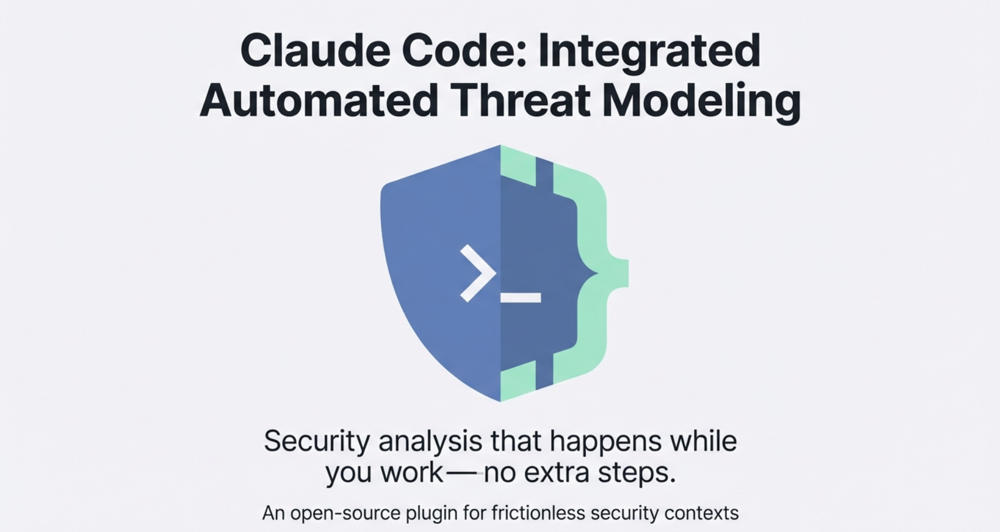
</p>

<p align="center">
  <code>3 skills • 182 lines • ~2K tokens • Minimal context window impact</code>
</p>

---

## The Problem

<p align="center">
  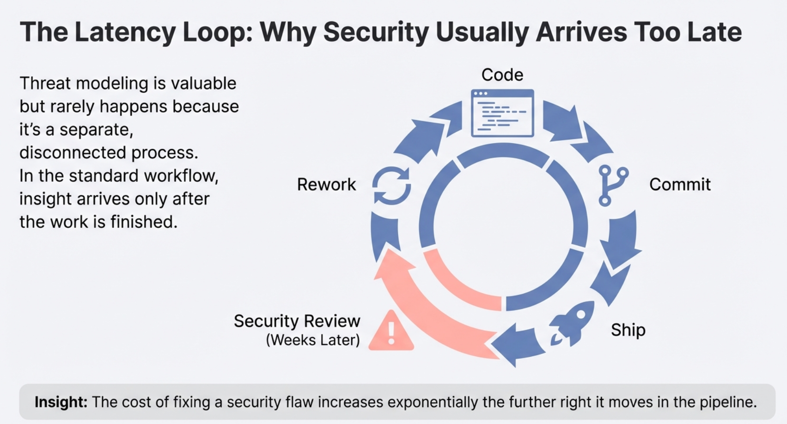
</p>

Security review arrives weeks after code is shipped. By then, fixing issues is expensive.

---

## The Solution

<p align="center">
  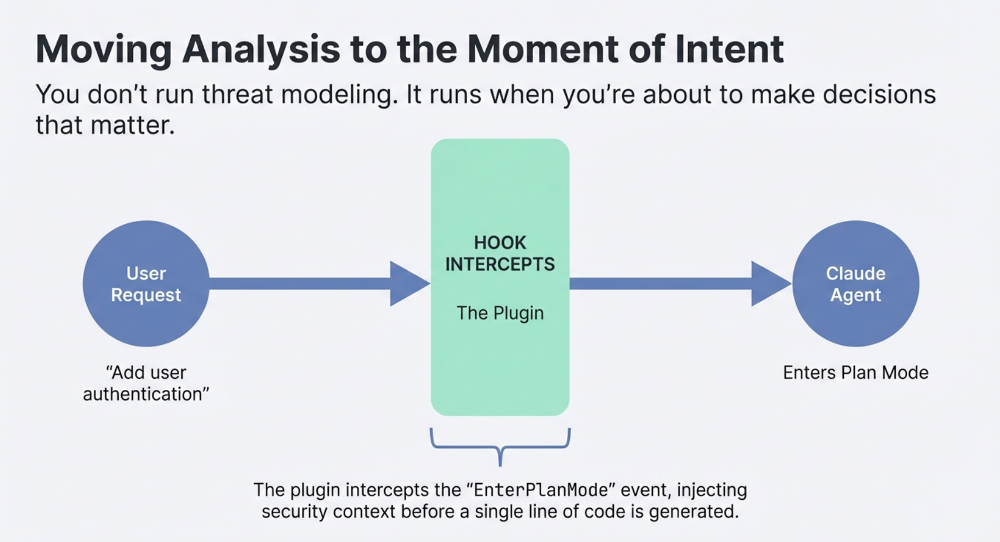
</p>

The plugin intercepts `EnterPlanMode`, injecting security context **before** a single line of code is generated.

---

## Zero Context Switching

<p align="center">
  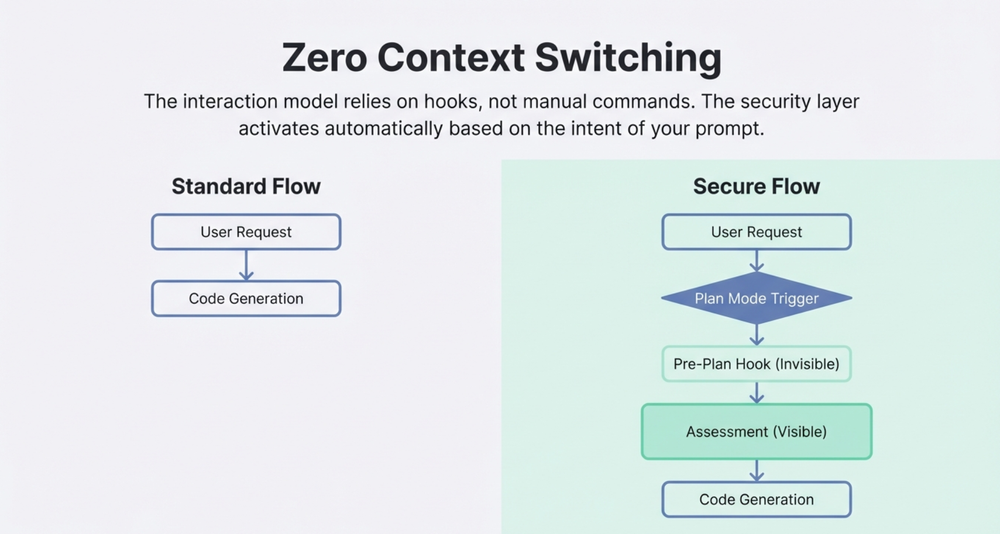
</p>

No commands to remember. The security layer activates automatically based on the intent of your prompt.

---

## How It Works

### Step 1: The Heuristic Scan

<p align="center">
  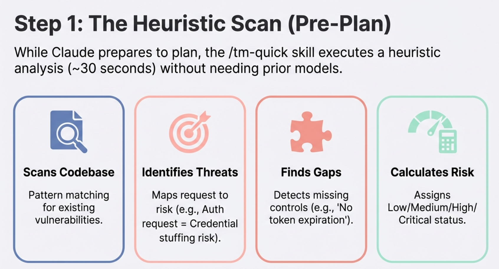
</p>

While Claude prepares to plan, `/tm-quick` executes a fast security scan (~30 seconds).

### Step 2: The Assessment

<p align="center">
  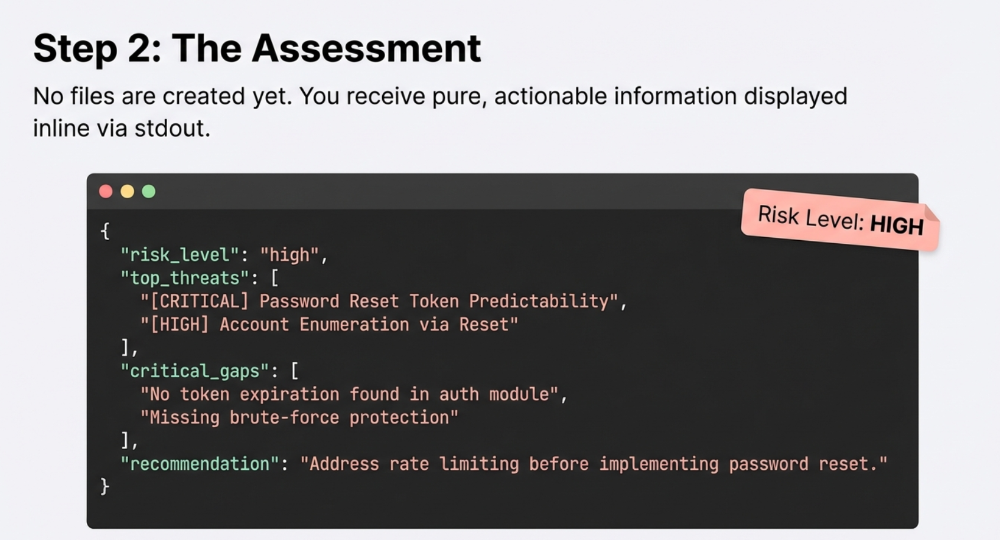
</p>

You receive pure, actionable information displayed inline. No files created yet.

### Step 3: The Decision Matrix

<p align="center">
  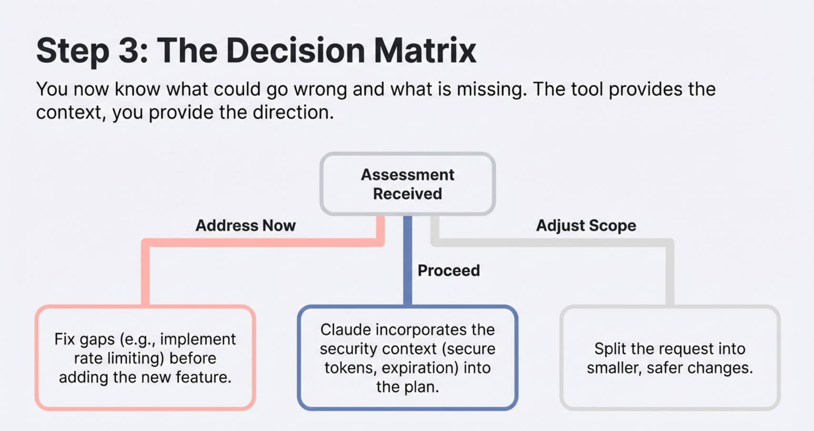
</p>

You now know what could go wrong. You decide the direction.

### Step 4: Context-Aware Execution

<p align="center">
  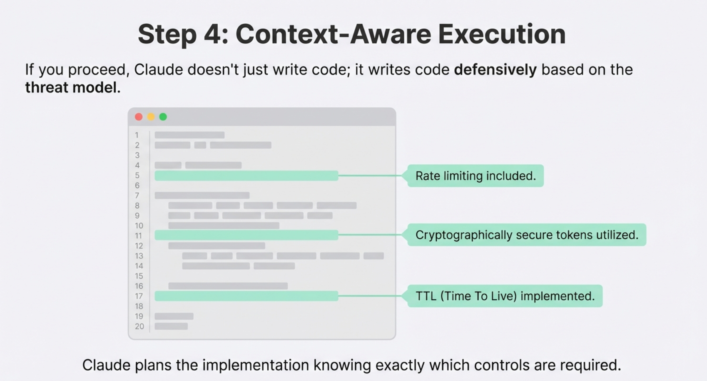
</p>

If you proceed, Claude writes code **defensively** based on the threat model.

### Step 5: Post-Plan Audit (Optional)

<p align="center">
  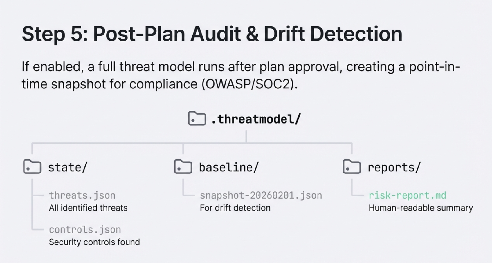
</p>

If enabled, a full threat model runs after plan approval, creating compliance snapshots.

---

## Configuration

<p align="center">
  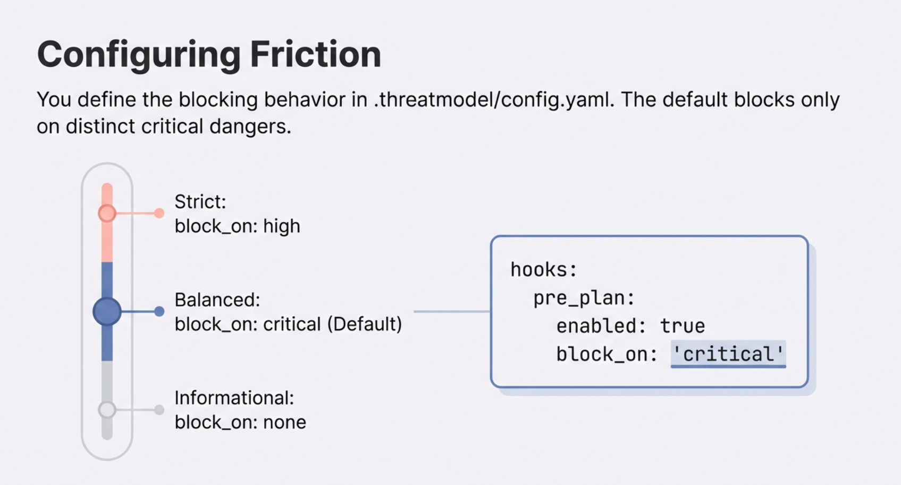
</p>

```yaml
# .threatmodel/config.yaml
hooks:
  pre_plan:
    enabled: true
    block_on: "critical" # strict | balanced (default) | informational
  post_plan:
    enabled: true
    compliance: ["owasp", "soc2"]
```

---

## Technical Architecture

<p align="center">
  
</p>

The hooks act as automated triggers for the underlying skill logic.

---

## Installation

<p align="center">
  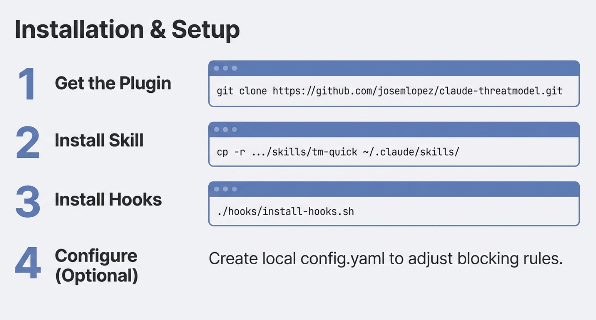
</p>

```bash
# 1. Get the plugin
git clone https://github.com/josemlopez/claude-threatmodel.git

# 2. Install skill
cp -r claude-threatmodel/skills/tm-quick ~/.claude/skills/

# 3. Install hooks
./claude-threatmodel/hooks/install-hooks.sh

# 4. (Optional) Configure
# Create .threatmodel/config.yaml to adjust blocking rules
```

---

## Why It Matters

<p align="center">
  
</p>

| Benefit           | Description                                            |
| ----------------- | ------------------------------------------------------ |
| **Frictionless**  | No extra commands. Security happens while you work.    |
| **Context-Aware** | Claude plans with security knowledge, reducing rework. |
| **Auditable**     | Automatic compliance mapping and drift detection.      |

---

## The 3 Skills

| Skill        | Purpose                      | When                    |
| ------------ | ---------------------------- | ----------------------- |
| `/tm-quick`  | Fast risk assessment (~30s)  | **Automatic** via hooks |
| `/tm-full`   | Complete STRIDE + compliance | On-demand               |
| `/tm-status` | Current posture overview     | Quick check             |

### Size & Token Impact

| Component | Lines   | Est. Tokens |
| --------- | ------- | ----------- |
| tm-quick  | 52      | ~600        |
| tm-full   | 77      | ~900        |
| tm-status | 53      | ~600        |
| **Total** | **182** | **~2,100**  |

Designed to minimize context window consumption.

---

## Project Structure

```
claude-threatmodel/
├── skills/
│   ├── tm-quick/          # Fast assessment (hooks)
│   ├── tm-full/           # Complete workflow
│   └── tm-status/         # Status overview
├── hooks/
│   ├── pre-plan-hook.sh   # EnterPlanMode trigger
│   ├── post-plan-hook.sh  # ExitPlanMode trigger
│   └── install-hooks.sh
├── shared/
│   ├── schemas/
│   ├── frameworks/
│   └── templates/
├── resources/             # Documentation images
└── README.md
```

---

## FAQ

**Q: What if I don't want blocking?**
Set `block_on: none`. You'll still see the assessment.

**Q: Does this slow down my workflow?**
~30 seconds. It runs while Claude prepares to plan anyway.

**Q: What if there's no existing threat model?**
Works without one. Uses heuristic analysis (pattern matching for vulnerabilities).

**Q: Difference between tm-quick and tm-full?**

|        | `/tm-quick`                | `/tm-full`                   |
| ------ | -------------------------- | ---------------------------- |
| Time   | ~30 seconds                | ~5 minutes                   |
| Output | JSON to stdout             | Files in `.threatmodel/`     |
| Scope  | Top threats, critical gaps | Complete STRIDE + compliance |

---

<p align="center">
  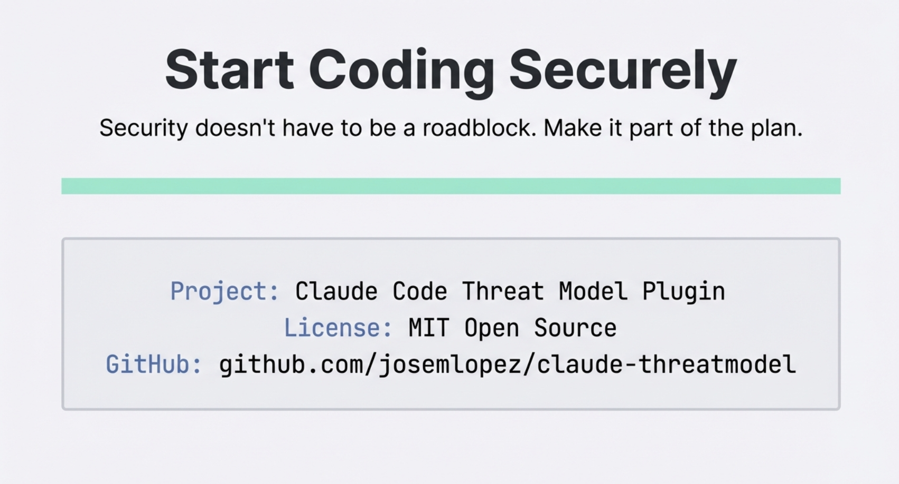
</p>

<p align="center">
  <strong>Security doesn't have to be a roadblock. Make it part of the plan.</strong>
</p>

<p align="center">
  <a href="https://github.com/josemlopez/claude-threatmodel">GitHub</a> •
  <a href="https://github.com/josemlopez/claude-threatmodel/issues">Issues</a> •
  MIT License
</p>
